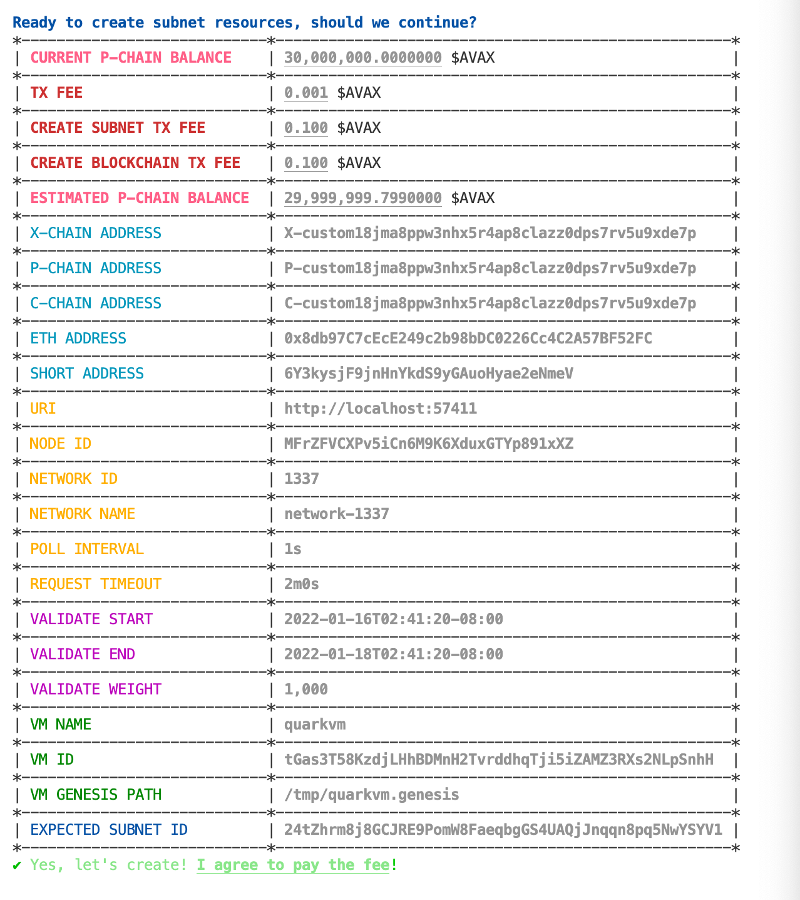
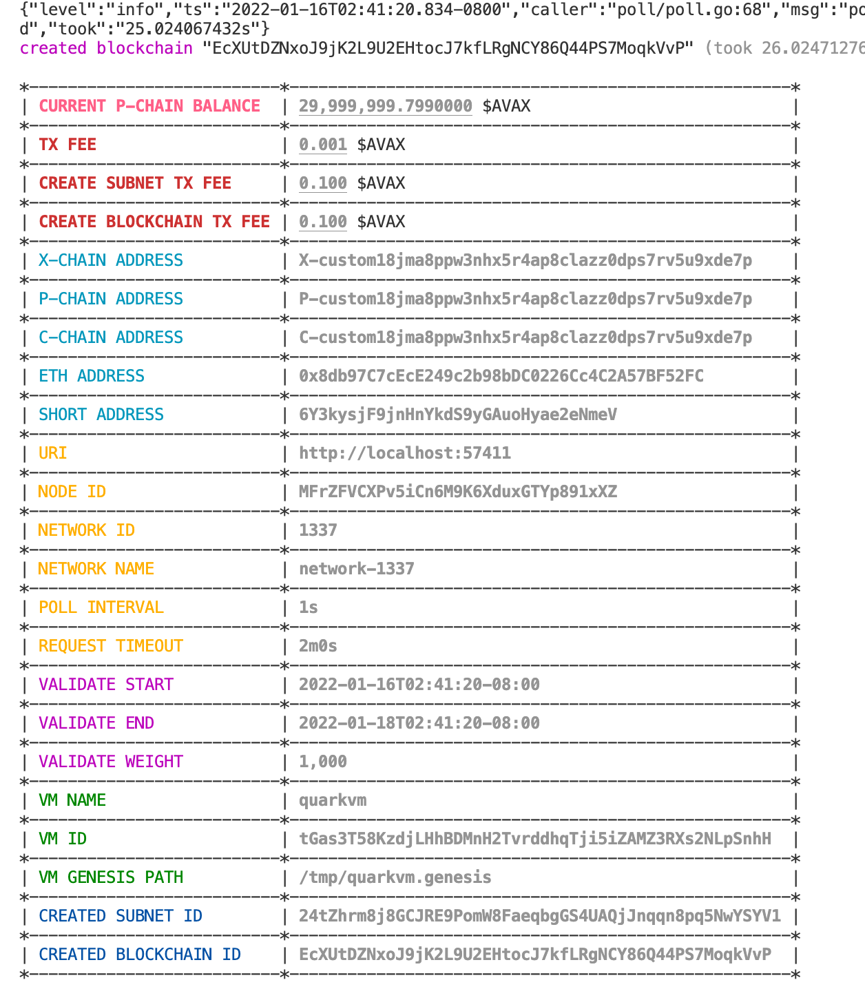

## `subnet-cli`

A command-line interface to manage Avalanche subnet.

```bash
# [OPTIONAL]
# build avalanchego for local testing
cd ${HOME}/go/src/github.com/ava-labs/avalanchego
rm -rf ./build
./scripts/build.sh

# [OPTIONAL]
# build test runner for local cluster setup
cd ${HOME}/go/src/github.com/ava-labs/subnet-cli/tests/runner
go build -o /tmp/subnet-cli.runner -v .
/tmp/subnet-cli.runner \
--avalanchego-path ${HOME}/go/src/github.com/ava-labs/avalanchego/build/avalanchego \
--whitelisted-subnets="24tZhrm8j8GCJRE9PomW8FaeqbgGS4UAQjJnqqn8pq5NwYSYV1" \
--output-path /tmp/subnet-cli.runner.yml

# [OPTIONAL]
# get cluster endpoints to send requests to
cat /tmp/subnet-cli.runner.yml
```

```yaml
avaxAssetId: BUuypiq2wyuLMvyhzFXcPyxPMCgSp7eeDohhQRqTChoBjKziC
cChainId: BR28ypgLATNS6PbtHMiJ7NQ61vfpT27Hj8tAcZ1AHsfU5cz88
logsDir: /var/folders/3j/n0vlnrvs6054fcjwtqzkrfkm0000gq/T/runnerlogs3797544684
networkId: 1337
pChainId: 11111111111111111111111111111111LpoYY
pid: 40388
uris:
- http://localhost:57574
- http://localhost:57576
- http://localhost:57578
- http://localhost:57580
- http://localhost:57582
xChainId: qzfF3A11KzpcHkkqznEyQgupQrCNS6WV6fTUTwZpEKqhj1QE7
```

Once you have the network endpoints (either from local test scripts or from existing cluster/network), run the following commands to create subnet:

```bash
cd ${HOME}/go/src/github.com/ava-labs/subnet-cli
go install -v .

cd ${HOME}/go/src/github.com/ava-labs/subnet-cli
subnet-cli create \
--enable-prompt=true \
--dry-mode=false \
--log-level=debug \
--private-key-path=.insecure.ewoq.key \
--uri=http://localhost:59114 \
--network-id=1337 \
--poll-interval=1s \
--request-timeout=2m \
--vm-name=my-custom-vm \
--vm-id=tGas3T58KzdjLHhBDMnH2TvrddhqTji5iZAMZ3RXs2NLpSnhH \
--vm-genesis-path=/tmp/my-custom-vm.genesis
```

Example prompt and outputs are:





See [`scripts/tests.e2e.sh`](scripts/tests.e2e.sh) and [`tests/e2e/e2e_test.go`](tests/e2e/e2e_test.go) for example tests.
