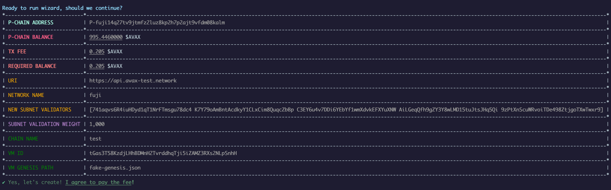
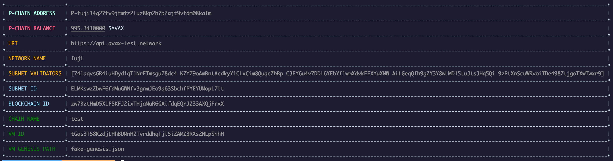
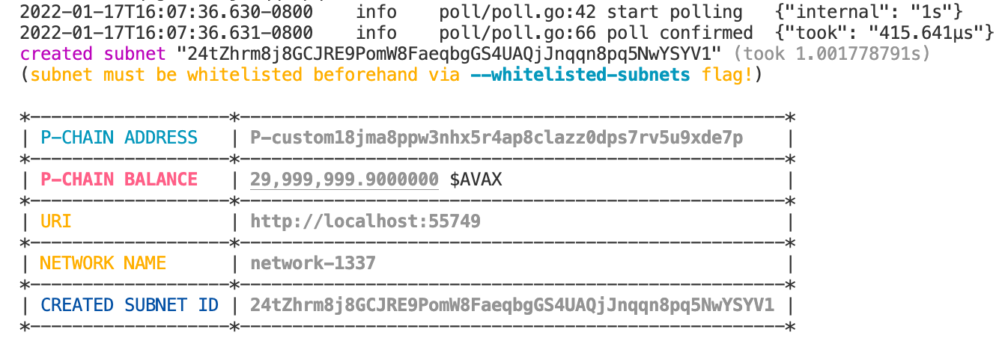
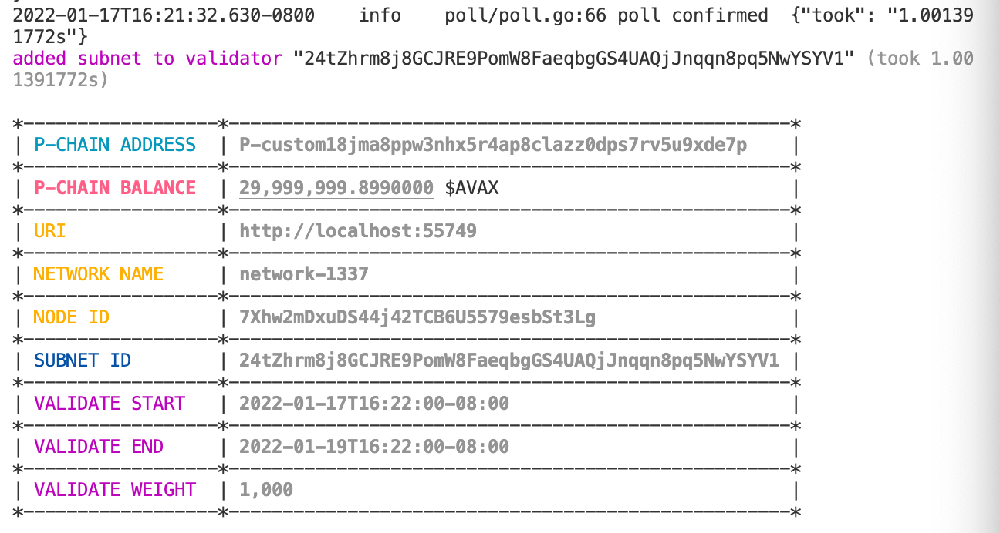
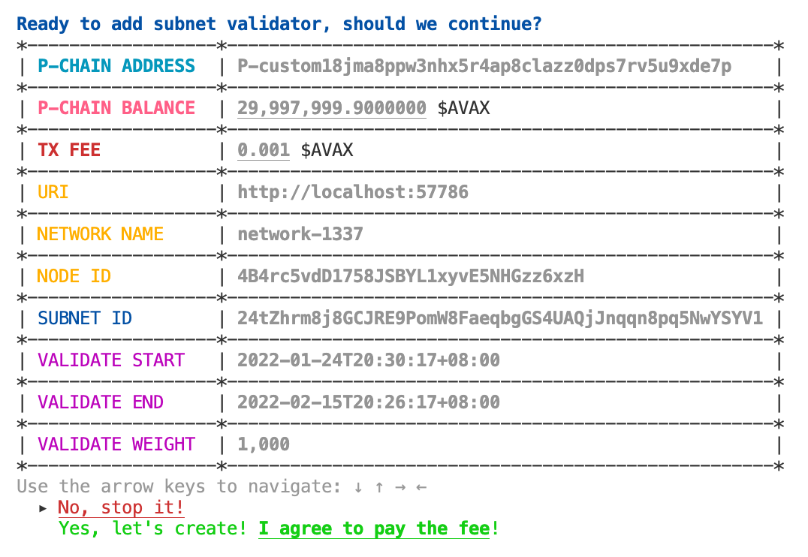
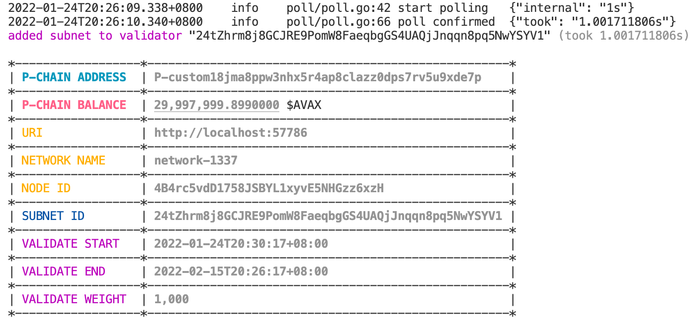
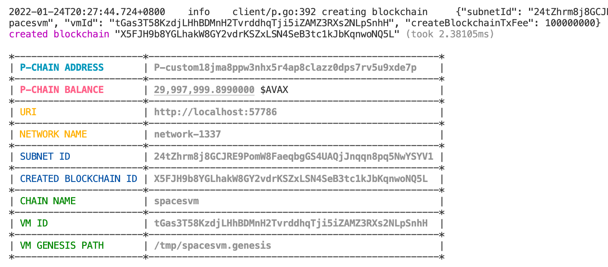

# subnet-cli

A command-line interface to manage [Avalanche Subnets](https://docs.avax.network/build/tutorials/platform/subnets).

## Install

```bash
git clone https://github.com/ava-labs/subnet-cli.git;
cd subnet-cli;
go install -v .;
```

Once you have installed `subnet-cli`, check the help page to confirm it is
working as expected (_make sure your $GOBIN is in your $PATH_):

```bash
subnet-cli CLI

Usage:
  subnet-cli [command]

Available Commands:
  add         Sub-commands for creating resources
  completion  Generate the autocompletion script for the specified shell
  create      Sub-commands for creating resources
  help        Help about any command
  status      status commands
  wizard      A magical command for creating an entire subnet

Flags:
      --enable-prompt              'true' to enable prompt mode (default true)
  -h, --help                       help for subnet-cli
      --log-level string           log level (default "info")
      --poll-interval duration     interval to poll tx/blockchain status (default 1s)
      --request-timeout duration   request timeout (default 2m0s)

Use "subnet-cli [command] --help" for more information about a command.
```

## Usage

The following commands will walk you through creating a subnet on Fuji.

### `subnet-cli create VMID`

This command is used to generate a valid VMID based on some string to uniquely
identify a VM. This should stay the same for all versions of the VM, so it
should be based on a word rather than the hash of some code.

```bash
subnet-cli create VMID <identifier> [--hash]
```

### `subnet-cli create key`

```bash
subnet-cli create key
```

`subnet-cli` will assume you have funds on this key (or `--private-key-path`) on the P-Chain for the
rest of this walkthrough.

The easiest way to do this (**for testing only**) is:

1) Import your private key (`.subnet-cli.pk`) into the [web wallet](https://wallet.avax.network)
2) Request funds from the [faucet](https://faucet.avax-test.network)
3) Move the test funds (sent on either the X or C-Chain) to the P-Chain [(Tutorial)](https://docs.avax.network/build/tutorials/platform/transfer-avax-between-x-chain-and-p-chain/)

After following these 3 steps, your test key should now have a balance on the
P-Chain.

### `subnet-cli wizard`
`wizard` is a magical command that:
* Adds all NodeIDs as validators on the primary network
* Creates a subnet
* Adds all NodeIDs as validators on the subnet
* Creates a new blockchain

To create a 4 node subnet:

```bash
subnet-cli wizard \
--node-ids=NodeID-741aqvs6R4iuHDyd1qT1NrFTmsgu78dc4,NodeID-K7Y79oAmBntAcdkyY1CLxCim8QuqcZbBp,NodeID-C3EY6u4v7DDi6YEbYf1wmXdvkEFXYuXNW,NodeID-AiLGeqQfh9gZY3Y8wLMD15tuJtsJHq5Qi \
--vm-genesis-path=fake-genesis.json \
--vm-id=tGas3T58KzdjLHhBDMnH2TvrddhqTji5iZAMZ3RXs2NLpSnhH \
--chain-name=test
```





### `subnet-cli create subnet`

```bash
subnet-cli create subnet
```

To create a subnet in the local network:

```bash
subnet-cli create subnet \
--private-key-path=.insecure.ewoq.key \
--public-uri=http://localhost:57786
```




### `subnet-cli add validator`

```bash
subnet-cli add validator \
--node-ids="[YOUR-NODE-ID]" \
--stake-amount=[STAKE-AMOUNT-IN-NANO-AVAX] \
--validate-reward-fee-percent=2
```

To add a validator to the local network:

```bash
subnet-cli add validator \
--private-key-path=.insecure.ewoq.key \
--public-uri=http://localhost:57786 \
--node-id="NodeID-4B4rc5vdD1758JSBYL1xyvE5NHGzz6xzH" \
--stake-amount=2000000000000 \
--validate-reward-fee-percent=3
```




### `subnet-cli add subnet-validator`

```bash
subnet-cli add subnet-validator \
--node-ids="[YOUR-NODE-ID]" \
--subnet-id="[YOUR-SUBNET-ID]"
```

To add a subnet validator to the local network:

```bash
subnet-cli add subnet-validator \
--private-key-path=.insecure.ewoq.key \
--public-uri=http://localhost:57786 \
--node-id="NodeID-4B4rc5vdD1758JSBYL1xyvE5NHGzz6xzH" \
--subnet-id="24tZhrm8j8GCJRE9PomW8FaeqbgGS4UAQjJnqqn8pq5NwYSYV1" \
--validate-start="2022-01-24T20:30:17+08:00" \
--validate-end="2022-02-15T20:26:17+08:00"
```




### `subnet-cli create blockchain`

```bash
subnet-cli create blockchain \
--subnet-id="[YOUR-SUBNET-ID]" \
--chain-name="[YOUR-CHAIN-NAME]" \
--vm-id="[YOUR-VM-ID]" \
--vm-genesis-path="[YOUR-VM-GENESIS-PATH]"
```

To create a blockchain with the local cluster:

```bash
subnet-cli create blockchain \
--private-key-path=.insecure.ewoq.key \
--public-uri=http://localhost:57786 \
--subnet-id="24tZhrm8j8GCJRE9PomW8FaeqbgGS4UAQjJnqqn8pq5NwYSYV1" \
--chain-name=spacesvm \
--vm-id=tGas3T58KzdjLHhBDMnH2TvrddhqTji5iZAMZ3RXs2NLpSnhH \
--vm-genesis-path=/tmp/spacesvm.genesis
```




### `subnet-cli status blockchain`

To check the status of the blockchain `2o5THyMs4kVfC42yAiSt2SrjWNkxCLYZef1kewkqYPEiBPjKtn` from a **private URI**:

```bash
subnet-cli status blockchain \
--private-uri=http://localhost:57786 \
--blockchain-id="X5FJH9b8YGLhakW8GY2vdrKSZxLSN4SeB3tc1kJbKqnwoNQ5L" \
--check-bootstrapped
```

See [`scripts/tests.e2e.sh`](scripts/tests.e2e.sh) and [`tests/e2e/e2e_test.go`](tests/e2e/e2e_test.go) for example tests.

## Running with local network

See [`avax-tester`](https://github.com/gyuho/avax-tester#avax-tester) or [`network-runner`](https://github.com/ava-labs/avalanche-network-runner).
