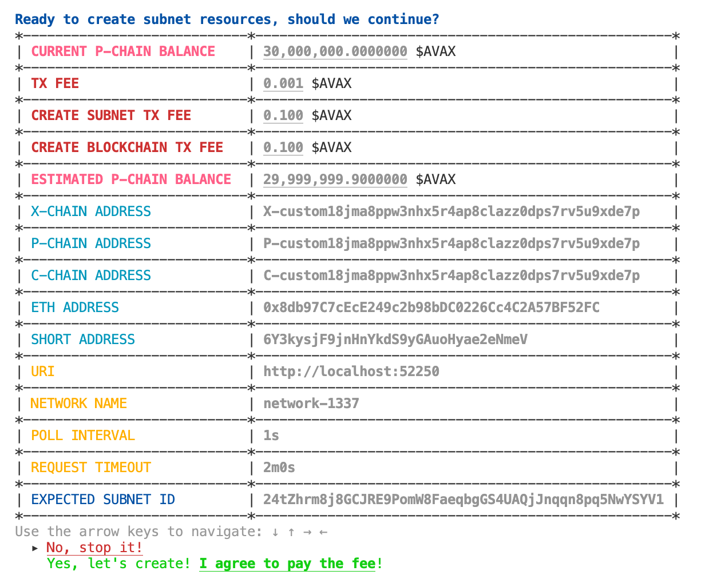
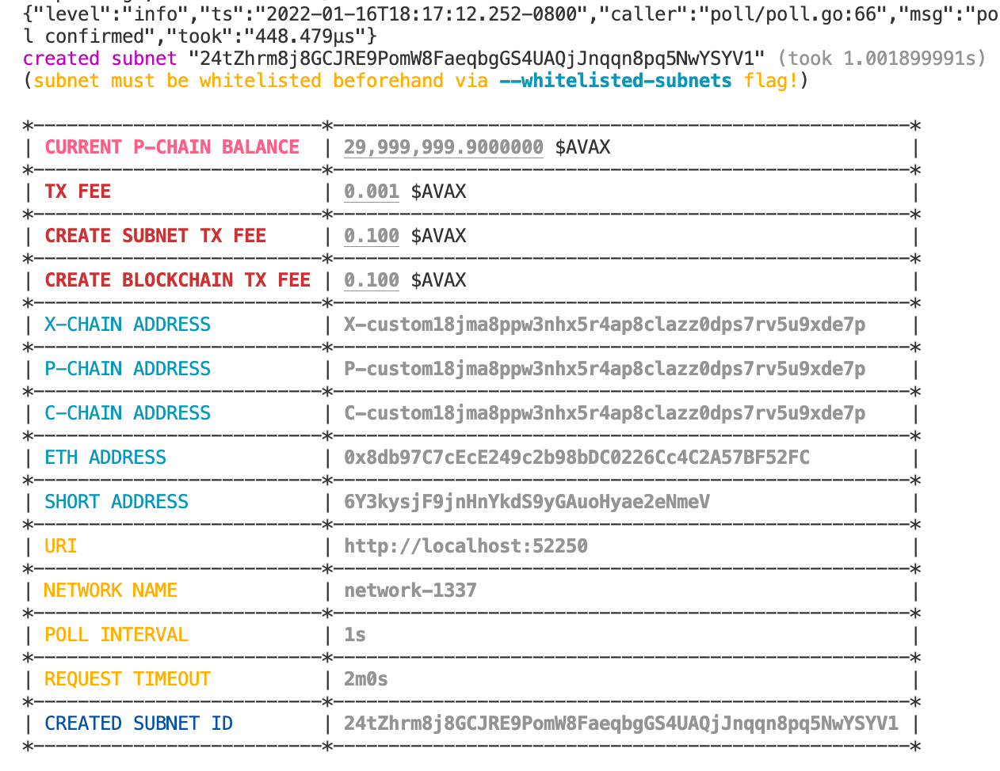
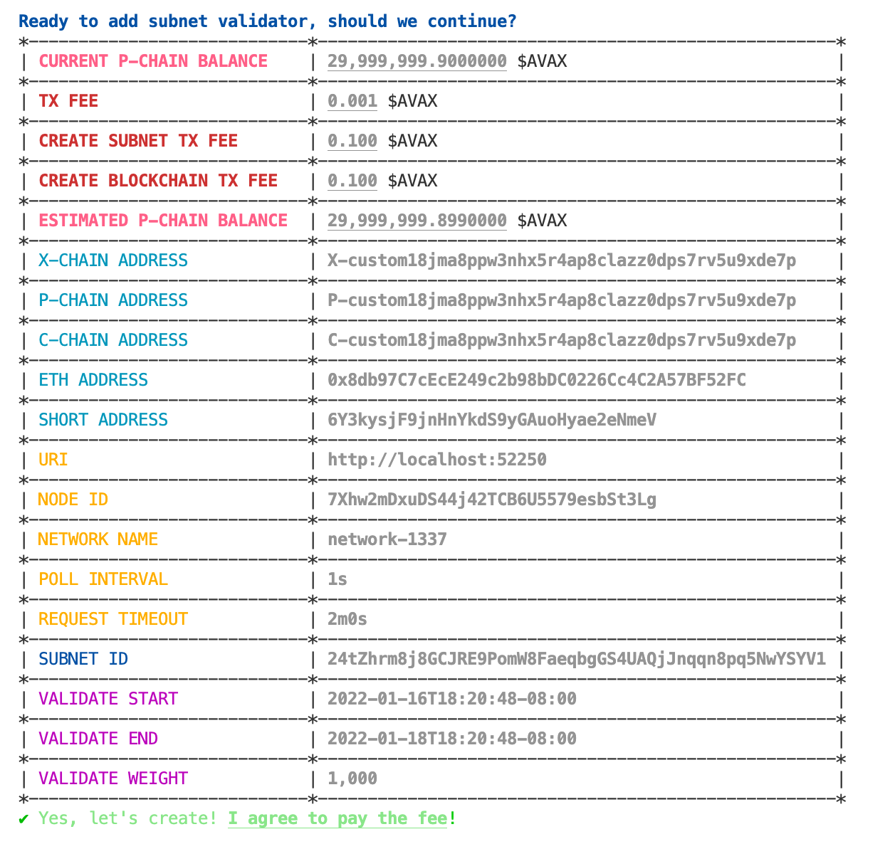
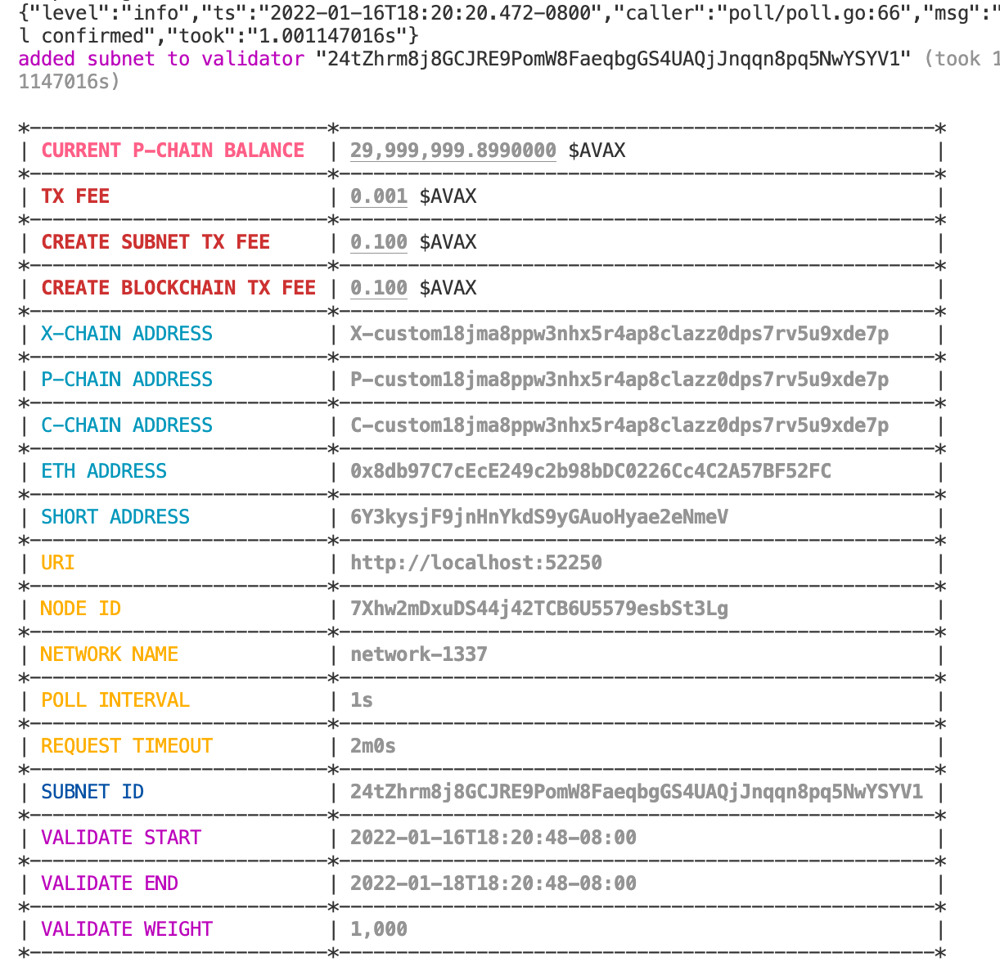
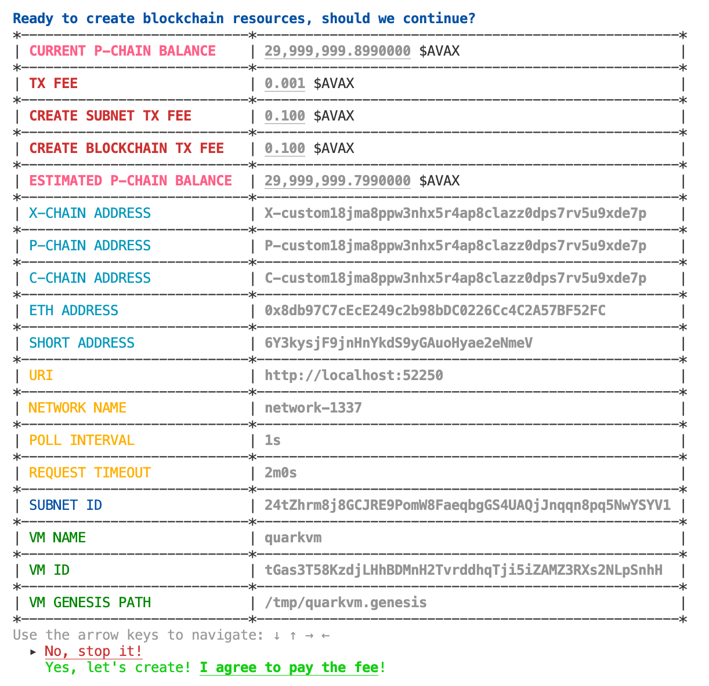
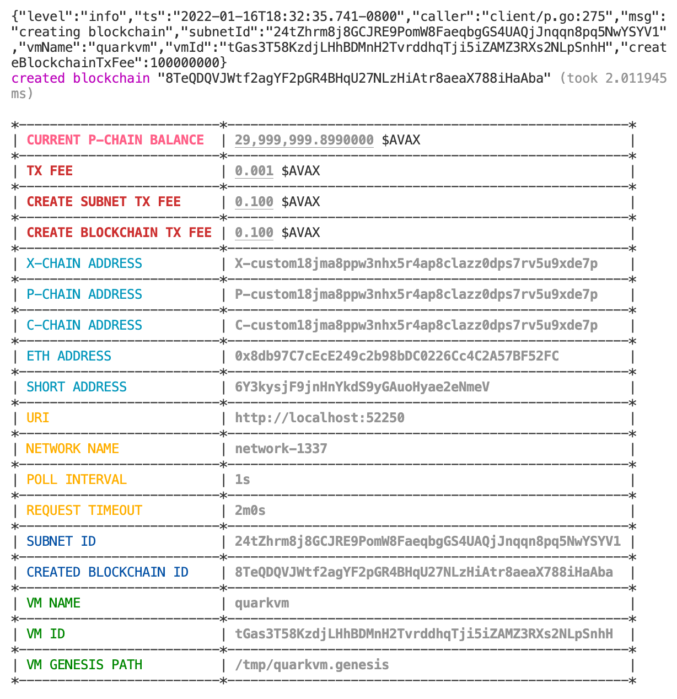

## `subnet-cli`

A command-line interface to manage Avalanche subnet.

```bash
# [OPTIONAL]
# build avalanchego for local testing
cd ${HOME}/go/src/github.com/ava-labs/avalanchego
rm -rf ./build
./scripts/build.sh

# [OPTIONAL]
# build test runner for local cluster setup
cd ${HOME}/go/src/github.com/ava-labs/subnet-cli/tests/runner
go build -o /tmp/subnet-cli.runner -v .
/tmp/subnet-cli.runner \
--avalanchego-path ${HOME}/go/src/github.com/ava-labs/avalanchego/build/avalanchego \
--whitelisted-subnets="24tZhrm8j8GCJRE9PomW8FaeqbgGS4UAQjJnqqn8pq5NwYSYV1" \
--output-path /tmp/subnet-cli.runner.yml

# [OPTIONAL]
# get cluster endpoints to send requests to
cat /tmp/subnet-cli.runner.yml
```

```yaml
avaxAssetId: BUuypiq2wyuLMvyhzFXcPyxPMCgSp7eeDohhQRqTChoBjKziC
cChainId: BR28ypgLATNS6PbtHMiJ7NQ61vfpT27Hj8tAcZ1AHsfU5cz88
logsDir: /var/folders/3j/n0vlnrvs6054fcjwtqzkrfkm0000gq/T/runnerlogs3797544684
networkId: 1337
pChainId: 11111111111111111111111111111111LpoYY
pid: 40388
uris:
- http://localhost:57574
- http://localhost:57576
- http://localhost:57578
- http://localhost:57580
- http://localhost:57582
xChainId: qzfF3A11KzpcHkkqznEyQgupQrCNS6WV6fTUTwZpEKqhj1QE7
```

Once you have the network endpoints (either from local test scripts or from existing cluster/network), run the following commands to create subnet:

```bash
cd ${HOME}/go/src/github.com/ava-labs/subnet-cli
go install -v .
```

### `subnet-cli create subnet`

```bash
# to create subnet only to the local cluster
subnet-cli create subnet \
--log-level=debug \
--private-key-path=.insecure.ewoq.key \
--uri=http://localhost:52250
```




```bash
# to create subnet only to the test network
subnet-cli create subnet \
--log-level=debug \
--private-key-path=.insecure.ewoq.key \
--uri=https://api.avax-test.network
```

### `subnet-cli add validator`

```bash
subnet-cli add validator \
--private-key-path=.insecure.ewoq.key \
--subnet-id="24tZhrm8j8GCJRE9PomW8FaeqbgGS4UAQjJnqqn8pq5NwYSYV1" \
--validate-weight=1000 \
--uri=http://localhost:52250
```




```bash
# for test network
subnet-cli add validator \
--private-key-path=.insecure.ewoq.key \
--subnet-id="24tZhrm8j8GCJRE9PomW8FaeqbgGS4UAQjJnqqn8pq5NwYSYV1" \
--validate-weight=1000 \
--uri=https://api.avax-test.network
```

### `subnet-cli create blockchain`

```bash
subnet-cli create blockchain \
--private-key-path=.insecure.ewoq.key \
--subnet-id="24tZhrm8j8GCJRE9PomW8FaeqbgGS4UAQjJnqqn8pq5NwYSYV1" \
--vm-name=myvm \
--vm-id=tGas3T58KzdjLHhBDMnH2TvrddhqTji5iZAMZ3RXs2NLpSnhH \
--vm-genesis-path=/tmp/myvm.genesis \
--uri=http://localhost:52250
```




```bash
subnet-cli create blockchain \
--private-key-path=.insecure.ewoq.key \
--subnet-id="24tZhrm8j8GCJRE9PomW8FaeqbgGS4UAQjJnqqn8pq5NwYSYV1" \
--vm-name=myvm \
--vm-id=tGas3T58KzdjLHhBDMnH2TvrddhqTji5iZAMZ3RXs2NLpSnhH \
--vm-genesis-path=/tmp/myvm.genesis \
--uri=https://api.avax-test.network
```

### `subnet-cli status blockchain`

To check the status of the blockchain `8TeQDQVJWtf2agYF2pGR4BHqU27NLzHiAtr8aeaX788iHaAba`:

```bash
subnet-cli status blockchain 8TeQDQVJWtf2agYF2pGR4BHqU27NLzHiAtr8aeaX788iHaAba \
--check-bootstrapped \
--uri=http://localhost:52250
```

```bash
subnet-cli status blockchain 8TeQDQVJWtf2agYF2pGR4BHqU27NLzHiAtr8aeaX788iHaAba \
--check-bootstrapped \
--uri=https://api.avax-test.network
```

See [`scripts/tests.e2e.sh`](scripts/tests.e2e.sh) and [`tests/e2e/e2e_test.go`](tests/e2e/e2e_test.go) for example tests.
